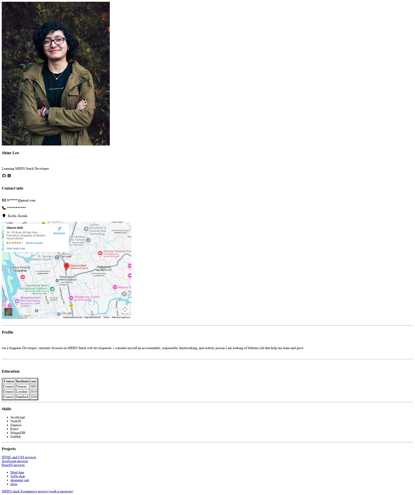

# # Project3 - Personal Portfolio (HTML)

This project is a simple **personal portfolio webpage** created using pure HTML and Font Awesome icons. It displays a brief profile, contact information, education details, skills, and links to various projects.

---

## 🧾 Table of Contents
- [Overview](#overview)
- [Features](#features)
- [Technologies Used](#technologies-used)
- [Project Structure](#project-structure)
- [Setup Instructions](#setup-instructions)
- [Usage](#usage)
- [Preview](#preview)
- [Future Enhancements](#future-enhancements)
- [Author](#author)

---

## 📖 Overview

The project serves as a **digital resume or portfolio page** for a beginner MERN Stack Developer — **Shine Leo**.  
It includes sections for:
- Profile and bio
- Contact information
- Embedded Google Map (location)
- Education details
- Technical skills
- Project links

This is an excellent starting point for anyone learning **HTML** and **front-end development**.

---

## ✨ Features

- Responsive HTML structure
- Integration with **Font Awesome** for icons
- Embedded **Google Maps** location
- Organized layout for personal and educational info
- External project links for showcasing work

---

## 🛠️ Technologies Used

- **HTML5**
- **Font Awesome (v7.0.1)** — for icons  
- **Unsplash** — for profile image  
- **Google Maps Embed** — for location display

---

## 📁 Project Structure

[live@](bibinresume.netlify.app)

